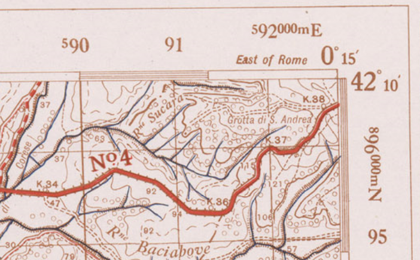
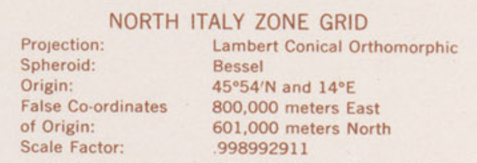
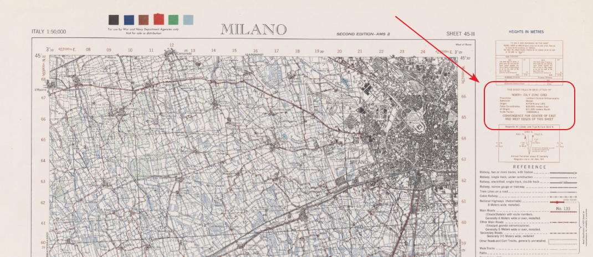
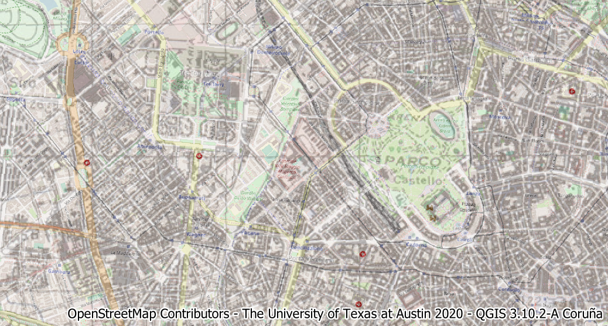

# Come creare un Sistema di Riferimento personalizzato: un esempio con mappe storiche

- issue correlata: [#113](https://github.com/opendatasicilia/tansignari/issues/113)
- autore: [Totò Fiandaca](https://twitter.com/totofiandaca); fornitore della ricetta: [Andrea Borruso](https://github.com/aborruso);
- ingredienti: [PROJ](https://proj.org/about.html), [GDAL](https://gdal.org/)

---

<!-- TOC -->

- [Come creare un Sistema di Riferimento personalizzato: un esempio con mappe storiche](#come-creare-un-sistema-di-riferimento-personalizzato-un-esempio-con-mappe-storiche)
  - [Introduzione](#introduzione)
  - [Come creare SR personalizzato a partire dalla GRID DATA](#come-creare-sr-personalizzato-a-partire-dalla-grid-data)
  - [Test su Milano](#test-su-milano)
    - [Output Milano georeferenziato](#output-milano-georeferenziato)
  - [Utilizzando le coordinate geografiche](#utilizzando-le-coordinate-geografiche)
  - [Riferimenti](#riferimenti)

<!-- /TOC -->

---

## Introduzione

La [biblioteca dell’università del Texas (USA)](https://legacy.lib.utexas.edu/maps/ams/italy_50k/) mette a disposizione (dominio pubblico) le carte topografiche `Published by War Office` militari dell’Italia in scala 1:50.000 (e tante altre) dell’anno 1941 (Series 4229, U.S. Army Map Service, 1941). Si tratta di mappe derivate da cartografie IGM e utilizzate durante la seconda guerra mondiale.

Sono mappe che rappresentano un contenuto geografico storico molto importante e per un proficuo riuso occorre georeferenziarle in modo da visualizzarle perfettamente sovrapposte alle mappe attuali. Il processo di georeferenziazione è complesso e passa per queste fasi:

1. lettura dei parametri della mappa direttamente nella cartografica;
2. determinazione dei gcp (Ground Control Points);
3. creazione di una stringa proj personalizzata, con tutti i parametri necessari (metodo di ricampionamento, di trasformazione, ecc...).

Osservando le mappa ci si accorge che hanno una doppia parametratura:

* la GRID DATA (in alcune mappe in blu) riferita alla proiezioni di **Lambert**;
* il reticolo geografico lungo il bordo è quella riferita al sistema originale della mappa (in DD MM), (probabilmente **Monte Mario geografico** quindi riferite al datum Roma40)



GRID DATA della mappa



---

## Come creare SR personalizzato a partire dalla GRID DATA

Ogni carta ha nel margine destro molte indicazioni tecniche per la corretta interpretazione, tra queste è presente la **GRID DATA** dove è possibile leggere i parametri necessari (ma non sufficienti) per ricostruire la proiezione usata:



```
Projection - Lambert Conical Orthomorphic  →    +proj=lcc
Spheroid : Bessel 1841                     →    +ellps=bessel
False Easting : 800000                     →    +x_0=800000
False Northing : 601000                    →    +y_0=601000
Central Meridian : 14° E                   →    +lon_0=14
Central Parallel : 45° 54'N                →    +lat_0=45.90 +lat_1=45.90
Scale Factor : 0.998992911                 →    +k_0=0.998992911
                       (other proj.4 terms)     +units=m +no_defs
```

Occorre tenere conto anche del **datum**: quello di **Monte Mario** basato su Hayford (International 1909) è stato adottato nel 1940, ma queste mappe sono basate sull'ellissoide di **Bessel** e bisogna applicare quindi i parametri di trasformazione legati a quest'ultimo.

Un riferimento bibliografico prezioso, per applicare i parametri di trasformazione correlati a questo caso è: [https://www.researchgate.net/profile/Gabor_Timar/publication/233406023_Geodetic_datums_of_the_Italian_cadastral_systems/links/0fcfd50a4ac50986ef000000/Geodetic-datums-of-the-Italian-cadastral-systems.pdf](https://www.researchgate.net/profile/Gabor_Timar/publication/233406023_Geodetic_datums_of_the_Italian_cadastral_systems/links/0fcfd50a4ac50986ef000000/Geodetic-datums-of-the-Italian-cadastral-systems.pdf)

I parametri "generici" per l'Italia sono:

```
dX= +656.5 m;
dY= +138.2 m;
dZ= +506.5 m;
rotX= –5.187 arc sec;
rotY= +2.540 arc sec;
rotZ= –5.256 arc sec;
scale factor= –12.61 ppm (according to ‘coordinate frame rotation’;
average horizontal error, except Sicilia and Southern Italy: 2.5 m;
maximum horizontal error: 5.6 m.)
```

quindi la stringa **proj** da usare è:

`+proj=lcc +lat_0=45.90 +lon_0=14 +lat_1=45.90 +x_0=800000 +y_0=601000 +k_0=0.998992911 +ellps=bessel +towgs84=656.5,138.2,506.5,5.187,-2.540,5.256,-12.61 +units=m +no_defs"`

La georeferenziazione sarà tanto migliore quanto più punti di controllo verranno tracciati. Come metodo di ricampionamento suggerito è il [**Thin Plate Spline**](https://it.wikipedia.org/wiki/Thin_plate_spline).

Sul numero di punti di controllo e sul metodo di ricampionamento è probabile che ci sia da fare un po' di test, per capire quale sia la scelta ottimale.

## Test su Milano

```
# delete existent images
rm ./output_gcp.tif
rm ./output_warped.tif
# download the image
curl -L "http://legacy.lib.utexas.edu/maps/ams/italy_50k/txu-pclmaps-oclc-6540719-milano-45-iii.jpg" >./output.jpg
# add control points
gdal_translate -of GTiff -gcp 532.292 2433.53 405000 551000 -gcp 2618.57 2316.82 424000 551000 -gcp 2388.9 467.338 423000 567000 -gcp 537.666 569.428 407000 567000 -gcp 933.404 1364.4 410000 560000 -gcp 2090.5 1299.92 420000 560000 -gcp 1462.72 517.946 415000 567000 -gcp 1576.18 2376.68 415000 551000 ./output.jpg ./output_gcp.tif
# apply the proj parameters
gdalwarp -r near -tps -co COMPRESS=PACKBITS  -t_srs "+proj=lcc +lat_0=45.90 +lon_0=14 +lat_1=45.90 +x_0=800000 +y_0=601000 +k_0=0.998992911 +ellps=bessel +towgs84=656.5,138.2,506.5,5.187,-2.540,5.256,-12.61 +units=m +no_defs" ./output_gcp.tif ./output_warped.tif
```

### Output Milano georeferenziato



## Utilizzando le coordinate geografiche

Nei 4 vertici di queste mappe sono indicate le coordinate geografiche, rispetto a Monte Mario. Facendo quindi riferimento sempre all'ellissoide di Bessel e ai parametri di trasformazione relativi (descritti sopra), si possono aggiungere alla mappa i 4 punti di controllo degli angoli in coordinate geografiche e definire la stringa `proj` in questo modo: `+proj=longlat +ellps=bessel +towgs84=656.5,138.2,506.5,5.187,-2.540,5.256,-12.61 +units=m +pm=rome +no_defs`.

A seguire un esempio di comandi con cui realizzare quanto descritto.

```bash
# scarica la mappa
curl -L "http://legacy.lib.utexas.edu/maps/ams/italy_50k/txu-pclmaps-oclc-6540719-milano-45-iii.jpg" >./output.jpg
# aggiungi i punti di controllo
gdal_translate -of GTiff -gcp 418.832 2486.39 -3.5 45.3333 -gcp 2689.8 2501.38 -3.25 45.3333 -gcp 2686.8 349.879 -3.25 45.5 -gcp 425.704 337.633 -3.5 45.5 ./output.jpg ./output_mm.tif
# riproietta la mappa
gdalwarp -r near -order 1 -co COMPRESS=PACKBITS  -t_srs "+proj=longlat +ellps=bessel +towgs84=656.5,138.2,506.5,5.187,-2.540,5.256,-12.61 +units=m +pm=rome +no_defs" ./output_mm.tif ./output_mm_warped.tif
```

---

## Riferimenti

- **gis.stackexchange** : <https://gis.stackexchange.com/questions/349635/setting-proj-parameters-of-old-map>
- **Geodetic datums of the Italian cadastral systems** : [https://www.researchgate.net/profile/Gabor_Timar/publication/233406023_Geodetic_datums_of_the_Italian_cadastral_systems/links/0fcfd50a4ac50986ef000000/Geodetic-datums-of-the-Italian-cadastral-systems.pdf](https://www.researchgate.net/profile/Gabor_Timar/publication/233406023_Geodetic_datums_of_the_Italian_cadastral_systems/links/0fcfd50a4ac50986ef000000/Geodetic-datums-of-the-Italian-cadastral-systems.pdf)
