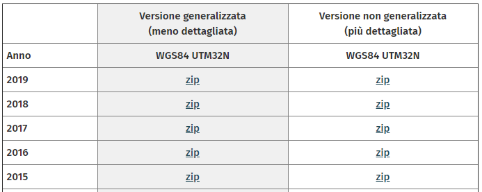

# Scraping archivio storico dataset ISTAT

* autore: _[Totò Fiandaca](https://twitter.com/totofiandaca?lang=it)_
* issue: [#78](https://github.com/opendatasicilia/tansignari/issues/78) fornitore ricetta *[Andrea Borruso](https://twitter.com/aborruso?lang=it)*
* ingredienti: [scrape](https://github.com/aborruso/scrape-cli), [yq](https://github.com/kislyuk/yq)

---

<!-- TOC -->

- [Scraping archivio storico dataset ISTAT](#Scraping-archivio-storico-dataset-ISTAT)
  - [In Bash](#In-Bash)
    - [CONFINI STATISTICO-AMMINISTRATIVI: ANALISI STORICA](#CONFINI-STATISTICO-AMMINISTRATIVI-ANALISI-STORICA)
    - [CONFINI DELLE UNITÀ AMMINISTRATIVE A FINI STATISTICI: RECENTI](#CONFINI-DELLE-UNIT%C3%80-AMMINISTRATIVE-A-FINI-STATISTICI-RECENTI)

<!-- /TOC -->

---

**Caso d'uso:** Scaricare archivi ISTAT in formato *.zip

## In Bash

### CONFINI STATISTICO-AMMINISTRATIVI: ANALISI STORICA

Scarica intero archivio `231601`

<p align="center"> <a href="https://www.istat.it/it/archivio/231601" target="_blank"></a>
</p>

```bash
# scarica la pagina
curl "https://www.istat.it/it/archivio/231601" | \
# estrai tramite CSS selector i tag <a> che stanno dentro un oggetto con classe "bordo_unico"
scrape -be '.bordo_unico a' | \
# trasforma l'output in JSON, estrai l'href dei tag a, anteponi la stringa per trasformarlo nell'URL di download
xq  -r '"https://www.istat.it/"+.html.body.a[]."@href"' | \
# passa l'output a xargs e usalo per lanciare un download per ogni riga di output
xargs -I _ wget _
```

### CONFINI DELLE UNITÀ AMMINISTRATIVE A FINI STATISTICI: RECENTI

Scarica intero archivio `222527` versione generalizzata (meno vertici)

<p align="center"> <a href="https://www.istat.it/it/archivio/222527" target="_blank"></a>
</p>

```bash
# scarica la pagina
curl "https://www.istat.it/it/archivio/222527" | \
# estrai tramite CSS selector i tag <a> che stanno dentro un oggetto con classe "bordo_unico"
scrape -be '.bordo_unico a' | \
# trasforma l'output in JSON, estrai l'href dei tag a, anteponi la stringa per trasformarlo nell'URL di download
xq  -r '.html.body.a[]."@href"' | \
# per filtrare il dataset generalizzato:
grep '/generalizzato'
# passa l'output a xargs e usalo per lanciare un download per ogni riga di output
xargs -I _ wget _
```

---

Ispirato da questo [tweet](https://twitter.com/napo/status/1144583972422373377) by [@napo](https://twitter.com/napo)