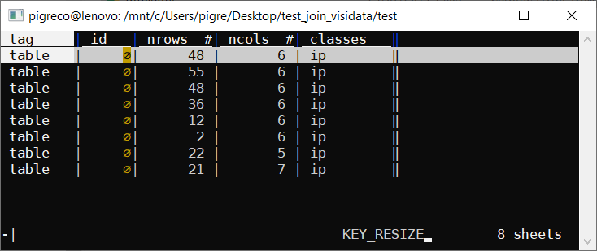
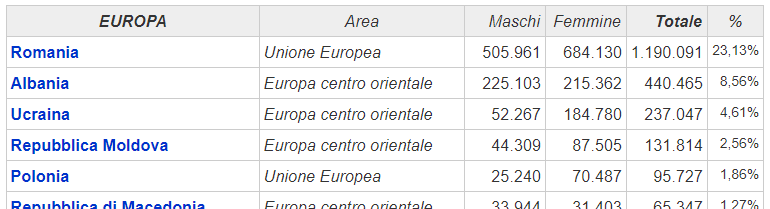
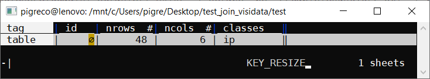

# Scraping tabella da sito web con molte tabelle html

* autore: _[Totò Fiandaca](https://twitter.com/totofiandaca?lang=it)_
* issue: [#79](https://github.com/opendatasicilia/tansignari/issues/79) fornitore ricetta *[Andrea Borruso](https://twitter.com/aborruso?lang=it)* e *[gbvitrano](https://twitter.com/gbvitrano)*
* ingredienti: [scrape](https://github.com/aborruso/scrape-cli), [XPATH](https://it.wikipedia.org/wiki/XPath), [VisiData](http://visidata.org/man/)

---

<!-- TOC -->

- [Scraping tabella da sito web con molte tabelle html](#Scraping-tabella-da-sito-web-con-molte-tabelle-html)
  - [In Bash](#In-Bash)
    - [scarico tutte le tabelle dal sito web](#scarico-tutte-le-tabelle-dal-sito-web)
      - [dove:](#dove)
    - [visualizzo tutte le tabelle con VisiData](#visualizzo-tutte-le-tabelle-con-VisiData)
      - [dove:](#dove-1)
    - [visualizzo solo la tabella con intestazione EUROPA](#visualizzo-solo-la-tabella-con-intestazione-EUROPA)
      - [dove:](#dove-2)

<!-- /TOC -->

---

**Caso d'uso:** Come scaricare una tabella da un sito web con molte tabelle html

## In Bash

### scarico tutte le tabelle dal sito web

- sito web: https://www.tuttitalia.it/statistiche/cittadini-stranieri-2018/

```bash
curl -L "https://www.tuttitalia.it/statistiche/cittadini-stranieri-2018/" | \
scrape -be '//table[contains(@class, 'ip')]' >tabelle.html
```
#### dove:
- `curl -L` scarica la pagina html
- `scrape -be` gratta dalla pagina appena scaricata tutte le tabelle _(table)_ la cui classe _(@class)_ contiene `ip`
- `>tabelle.html` salvo in formato html


### visualizzo tutte le tabelle con VisiData

```bash
curl -L "https://www.tuttitalia.it/statistiche/cittadini-stranieri-2018/" | \
scrape -be '//table[contains(@class, 'ip')]' | vd -f html
```

#### dove:
- `curl -L` scarica la pagina html
- `scrape -be` gratta dalla pagina appena scaricata tutte le tabelle _(table)_ la cui classe _(@class)_ contiene `ip`
- `vd -f html` apro l'elenco delle tabelle html con VisiData



### visualizzo solo la tabella con intestazione EUROPA



```bash
curl -L "https://www.tuttitalia.it/statistiche/cittadini-stranieri-2018/" | \
scrape -be '//table[.//th/b[contains(., "EUROPA")]]' | \
vd -f html
```

#### dove:
- `curl -L` scarica la pagina html
- `scrape -be` gratta dalla pagina appena scaricata la tabella _(table)_ la cui intestazione _(th/b)_ contiene `EUROPA`
- `vd -f html` apro l'elenco delle tabelle html con VisiData

ottenendo:



per visualizzare la tabella premere `invio`

```
+----------------------+-------------------------+---------+---------+-----------+--------+
| EUROPA               | Area                    | Maschi  | Femmine | Totale    | %      |
+----------------------+-------------------------+---------+---------+-----------+--------+
| Paesi Bassi          | Unione Europea          | 3.674   | 4.670   | 8.344     | 0,16%  |
| Svizzera             | Altri paesi europei     | 3.255   | 4.659   | 7.914     | 0,15%  |
| Irlanda              | Unione Europea          | 1.350   | 1.586   | 2.936     | 0,06%  |
| Croazia              | Europa centro orientale | 8.784   | 8.789   | 17.573    | 0,34%  |
| Grecia               | Unione Europea          | 3.941   | 3.631   | 7.572     | 0,15%  |
| Islanda              | Altri paesi europei     | 46      | 97      | 143       | 0,00%  |
| Ucraina              | Europa centro orientale | 52.267  | 184.780 | 237.047   | 4,61%  |
| Repubblica di Serbia | Europa centro orientale | 19.551  | 20.139  | 39.690    | 0,77%  |
| Romania              | Unione Europea          | 505.961 | 684.130 | 1.190.091 | 23,13% |
| Lettonia             | Unione Europea          | 541     | 2.372   | 2.913     | 0,06%  |
+----------------------+-------------------------+---------+---------+-----------+--------+
```
---

Per maggiori dettagli leggere Issue correlata [#79](https://github.com/opendatasicilia/tansignari/issues/79)
