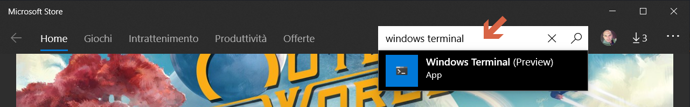
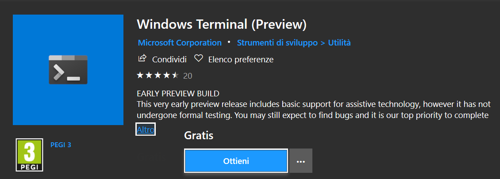
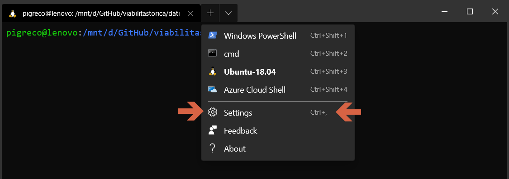
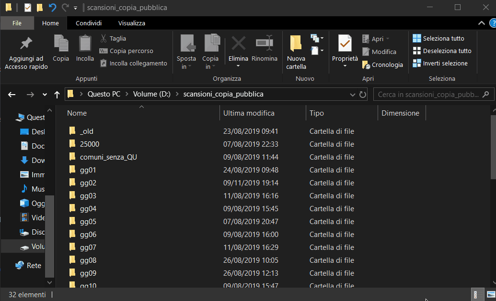

# Windows Terminal

## Che cosa è

INFORMAZIONI SUL TERMINAL DI WINDOWS
Windows Terminal è una nuova, moderna, veloce, efficiente, potente e produttiva applicazione terminale per gli utenti di strumenti da riga di comando e shell come Prompt dei comandi, PowerShell e WSL. Le sue caratteristiche principali includono più schede, supporto dei caratteri Unicode e UTF-8, un motore di rendering del testo con accelerazione GPU e temi, stili e configurazioni personalizzati.

Questo è un progetto **open source** e accogliamo con favore la partecipazione della comunità. Per partecipare, visitare https://github.com/microsoft/terminal

## Come installarlo

Dalla Store di Microsoft cercare `windows terminal`:

e poi cliccare su `ottieni`:

## Configurazione

Durante l'installazione verrà creato un file `profiles.json` che conterrà le impostazioni di default del terminale, per esempio la shell impostata è la `WindowsPowerShell`:

Per personalizzare la `wt` (windows terminal) occorre modificare il file `profiles.json`, per esempio:

- per ottenere linux (Ubuntu-18.04 in questo esempio) come shell predefinita occorre cambiare la `guid` del file json;
- per lanciare il terminale da una qualsiasi cartella windows, occorre impostare `"startingDirectory" : null`, ecco un esempio:

